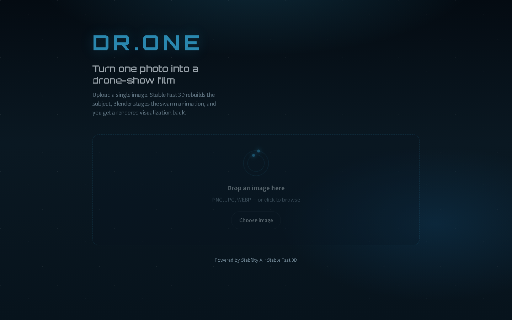

# DR.ONE

**DR.ONE — Drone Rendering (Version) One**

An AI-powered **2D → 3D drone-show visualization** pipeline. Upload a single image, reconstruct a textured 3D mesh with [Stable Fast 3D (SF3D)](https://github.com/Stability-AI/stable-fast-3d), stage a glowing drone-swarm formation in Blender, and play back the rendered MP4 in a local web UI.



> Powered by Stability AI · Built for research, demos, and creative exploration.

---

## Table of contents

- [Features](#features)
- [Architecture](#architecture)
- [Repository layout](#repository-layout)
- [Requirements](#requirements)
- [Quick start](#quick-start)
- [Environment setup (detailed)](#environment-setup-detailed)
- [Running the web app](#running-the-web-app)
- [CLI / offline usage](#cli--offline-usage)
- [API reference](#api-reference)
- [Configuration](#configuration)
- [Blender assets](#blender-assets)
- [Troubleshooting](#troubleshooting)
- [License & attribution](#license--attribution)
- [Citation](#citation)

---

## Features

- **Single-image 3D reconstruction** via Stable Fast 3D (UV-unwrapped `mesh.glb`)
- **Automatic background removal** with `rembg`
- **Blender drone visualization** — vertices become glowing drones with orbit camera and night-sky backdrop
- **Local web UI** — drag-and-drop upload, live progress, in-browser video playback + download
- **FastAPI backend** with job status polling and Vite-dev proxy
- **Shared pipeline service** used by both the web UI and the desktop CLI entrypoint

---

## Architecture

```text
┌─────────────────┐     /api/* proxy      ┌──────────────────────┐
│  Vite frontend  │ ───────────────────►  │  FastAPI (server.py) │
│  :5173          │ ◄───────────────────  │  :8000               │
└─────────────────┘   status + video MP4  └──────────┬───────────┘
                                                     │
                                          pipeline_service.py
                                                     │
                         ┌───────────────────────────┼───────────────────────────┐
                         ▼                           ▼                           ▼
                   uploads/{job}/              run.py (SF3D)              Blender 4.x
                   input image            output/{name}/mesh.glb    updated_render.py
                                                                     night_env1.blend
                                                                             │
                                                                             ▼
                                                          blender/animations/{name}/{name}.mp4
```

**Processing stages**

1. **Upload** — image saved under `uploads/{job_id}/`
2. **SF3D** — background removal, foreground resize, mesh generation → `output/{name}/mesh.glb`
3. **Blender** — import mesh, reduce vertices, place drones, animate, append night sky, render H.264 MP4
4. **Playback** — frontend polls job status, then streams `/api/videos/{name}/{name}.mp4`

---

## Repository layout

```text
DR.ONE/
├── frontend/                 # Vite UI (upload → progress → video)
├── blender/
│   ├── scripts/              # updated_render.py (production) + helpers
│   ├── assets/scenes/night_sky/night_env1.blend   # REQUIRED background
│   └── animations/           # rendered MP4s (gitignored; created at runtime)
├── sf3d/                     # Stable Fast 3D model code
├── load/tets/                # Marching tetrahedra data (required)
├── demo_files/               # Official SF3D example images + HDRIs
├── definitions.py            # Paths / Blender discovery / env config
├── pipeline_service.py       # Shared SF3D + Blender orchestration
├── server.py                 # FastAPI backend
├── run.py                    # SF3D CLI inference
├── executable_pipeline.py    # Desktop file-dialog + full pipeline
├── gradio_app.py             # Optional SF3D mesh viewer (Gradio)
├── requirements.txt          # Core ML deps
├── requirements-web.txt      # FastAPI / Uvicorn / multipart / dotenv
├── requirements-demo.txt     # Gradio demo deps
├── .env.example              # Config template
├── NOTICE                    # Stability AI attribution
├── LICENSE.md                # Stability AI Community License (SF3D materials)
└── start_web.ps1             # Windows helper to launch API + UI
```

---

## Requirements

| Component | Notes |
|-----------|--------|
| **OS** | Windows 10/11 recommended (tested). Linux/macOS possible with Blender path set |
| **Python** | 3.8–3.11 (3.10 recommended) |
| **GPU** | NVIDIA CUDA GPU (**required** for SF3D texture baking) · ~6GB+ VRAM typical |
| **PyTorch** | Install the CUDA build matching your driver ([pytorch.org](https://pytorch.org/get-started/locally/)) |
| **Blender** | 4.2 recommended ([download](https://www.blender.org/download/)) |
| **Node.js** | 18+ for the Vite frontend ([download](https://nodejs.org/)) |
| **Disk** | Space for Hugging Face model weights + renders |
| **Network** | First run downloads `stabilityai/stable-fast-3d` from Hugging Face |

---

## Quick start

```bash
# 1) Clone
git clone https://github.com/OmAIr-K/DR.ONE.git
cd DR.ONE

# 2) Python env + deps
python -m venv .venv
# Windows:
.venv\Scripts\activate
# macOS/Linux:
# source .venv/bin/activate

pip install -U "setuptools==69.5.1"
# Install PyTorch for YOUR CUDA version first (see pytorch.org), then:
pip install -r requirements.txt
pip install -r requirements-web.txt

# 3) Config
copy .env.example .env          # Windows
# cp .env.example .env          # macOS/Linux
# Edit .env → set DRONE_BLENDER_PATH if Blender is not auto-detected

# 4) Frontend deps
cd frontend
npm install
cd ..

# 5) Run (two terminals)
uvicorn server:app --host 127.0.0.1 --port 8000
cd frontend && npm run dev
```

Open **http://127.0.0.1:5173/** — upload an image, wait for mesh + render, watch the MP4.

Windows one-liner helper (after deps are installed):

```powershell
.\start_web.ps1
```

Health check: **http://127.0.0.1:8000/api/health** should report `blender_found` and `background_found` as `true`.

---

## Environment setup (detailed)

### 1. Clone the repository

```bash
git clone https://github.com/OmAIr-K/DR.ONE.git
cd DR.ONE
```

### 2. Create and activate a virtual environment

```bash
python -m venv .venv
```

| Platform | Activate |
|----------|----------|
| Windows (PowerShell) | `.venv\Scripts\Activate.ps1` |
| Windows (cmd) | `.venv\Scripts\activate.bat` |
| macOS / Linux | `source .venv/bin/activate` |

### 3. Install PyTorch (CUDA)

Install **before** `requirements.txt` so the correct CUDA wheel is used:

1. Visit https://pytorch.org/get-started/locally/
2. Select your OS, Pip, and CUDA version
3. Run the provided `pip install` command

Verify:

```bash
python -c "import torch; print(torch.__version__, torch.cuda.is_available())"
```

`torch.cuda.is_available()` must be `True`.

### 4. Upgrade setuptools, then install Python packages

```bash
pip install -U "setuptools==69.5.1"
pip install -r requirements.txt
pip install -r requirements-web.txt
```

Optional Gradio mesh demo:

```bash
pip install -r requirements-demo.txt
```

### 5. Install Blender

1. Download Blender 4.2+ from https://www.blender.org/download/
2. Install it (Windows default: `C:\Program Files\Blender Foundation\Blender 4.2\blender.exe`)
3. If not auto-detected, set `DRONE_BLENDER_PATH` in `.env`

### 6. Install Node.js and frontend packages

1. Install Node.js 18+ from https://nodejs.org/
2. Then:

```bash
cd frontend
npm install
cd ..
```

### 7. Hugging Face model weights

On first SF3D run, weights download automatically from  
[`stabilityai/stable-fast-3d`](https://huggingface.co/stabilityai/stable-fast-3d).

If the repo is gated or rate-limited:

```bash
pip install huggingface_hub
huggingface-cli login
```

Accept the model license on the Hugging Face model card if prompted.

### 8. Confirm required assets

These must exist after clone:

| Path | Purpose |
|------|---------|
| `blender/assets/scenes/night_sky/night_env1.blend` | Night-sky background (object `Water`) |
| `blender/scripts/updated_render.py` | Visualization + render script |
| `load/tets/160_tets.npz` | SF3D isosurface data |
| `sf3d/` | Model implementation |

---

## Running the web app

**Terminal A — API**

```bash
uvicorn server:app --host 127.0.0.1 --port 8000
```

**Terminal B — UI**

```bash
cd frontend
npm run dev
```

| Service | URL |
|---------|-----|
| Frontend | http://127.0.0.1:5173/ |
| API | http://127.0.0.1:8000/ |
| Health | http://127.0.0.1:8000/api/health |
| API docs | http://127.0.0.1:8000/docs |

The Vite config proxies `/api` → `http://127.0.0.1:8000`, so the browser only talks to `:5173`.

**Typical timings** (hardware-dependent): mesh ~seconds–tens of seconds; Blender render can take several minutes.

---

## CLI / offline usage

### SF3D only (mesh GLB)

```bash
python run.py demo_files/examples/chair1.png --output-dir output/
```

Useful flags: `--texture-resolution 1024`, `--remesh_option none|triangle|quad`, `--device cuda:0`

### Full pipeline (file dialog)

```bash
python executable_pipeline.py
```

Select an image → SF3D → Blender → opens the MP4 when done.

### Gradio mesh viewer (optional)

```bash
python gradio_app.py
```

Interactive SF3D mesh preview (no drone video).

---

## API reference

| Method | Path | Description |
|--------|------|-------------|
| `GET` | `/api/health` | Service + Blender/background path checks |
| `POST` | `/api/process` | Multipart upload field `file` → starts job |
| `GET` | `/api/status/{job_id}` | Progress, logs, `video_url` when complete |
| `GET` | `/api/videos/{stem}/{filename}` | Stream rendered MP4 |
| `GET` | `/api/jobs` | List in-memory jobs |

Example upload (PowerShell):

```powershell
curl.exe -F "file=@demo_files/examples/chair1.png" http://127.0.0.1:8000/api/process
```

---

## Configuration

Copy `.env.example` to `.env`:

```env
# Required if Blender is not on PATH / not in a default install location
DRONE_BLENDER_PATH=C:\Program Files\Blender Foundation\Blender 4.2\blender.exe

# Optional — override auto-discovered night-sky asset
# DRONE_BGD_PATH=blender/assets/scenes/night_sky/night_env1.blend
# DRONE_BGD_OBJECT=Water
```

| Variable | Default | Meaning |
|----------|---------|---------|
| `DRONE_BLENDER_PATH` | Auto-discover | Absolute path to Blender executable |
| `DRONE_BGD_PATH` | Auto-discover under `blender/assets/scenes/night_sky/` | Custom night-sky `.blend` (absolute or repo-relative) |
| `DRONE_BGD_OBJECT` | `Water` | Object appended from the night-sky `.blend` |

Paths for uploads, outputs, and renders are defined in `definitions.py`.

---

## Blender assets

**Required (shipped in this repo)**

- `blender/assets/scenes/night_sky/night_env1.blend` — night environment; pipeline appends object `Water`

**Generated locally (ignored by Git)**

- `blender/animations/{name}/{name}.mp4` — final videos
- `output/{name}/mesh.glb` — SF3D meshes
- `uploads/` — user uploads

**Not required for the web pipeline**

- Experiment `.blend` project files, `.blend1` backups, sample GLBs under `extras/`

Production Blender entrypoint: `blender/scripts/updated_render.py`  
CLI args after `--`: `--input_image`, `--mesh_path`, `--bgd_path`, `--bgd_object`, `--render_name`

---

## Troubleshooting

| Symptom | What to try |
|---------|-------------|
| `CUDA is not available` | Install CUDA PyTorch; check `nvidia-smi` |
| `Blender not found` | Set `DRONE_BLENDER_PATH` in `.env` |
| `Background blend missing` | Ensure `night_env1.blend` is present under `blender/assets/scenes/night_sky/` |
| `Cannot reach the API` (UI) | Start `uvicorn` on port 8000; confirm Vite proxy |
| Hugging Face download fails | `huggingface-cli login`; accept model terms |
| Render is very slow | Expected for full animation; reduce scene complexity later if needed |
| Port 8000 in use | Stop the other process or change the uvicorn port (update Vite proxy too) |

---

## License & attribution

This project includes and extends **Stable Fast 3D** materials.

- **SF3D / Stability AI model code & weights usage** — see [`LICENSE.md`](LICENSE.md) (**Stability AI Community License**)
- **Attribution** — see [`NOTICE`](NOTICE). The UI displays **Powered by Stability AI**
- Commercial use of Stability AI materials may require registration — review the Community License and https://stability.ai/community-license

Respect both this repository’s project terms and Stability AI’s license when redistributing or deploying.

---

## Citation

If you use Stable Fast 3D / SF3D in research, please cite:

```bibtex
@article{sf3d2024,
  title={SF3D: Stable Fast 3D Mesh Reconstruction with UV-unwrapping and Illumination Disentanglement},
  author={Boss, Mark and Huang, Zixuan and Vasishta, Aaryaman and Jampani, Varun},
  journal={arXiv preprint},
  year={2024}
}
```

Paper: https://arxiv.org/abs/2408.00653

---

## Acknowledgments

- [Stability AI — Stable Fast 3D](https://github.com/Stability-AI/stable-fast-3d)
- [Blender Foundation](https://www.blender.org/)
- Hugging Face model hosting for `stabilityai/stable-fast-3d`

---

## Contributing

1. Fork the repo / create a feature branch  
2. Keep large renders and local `.blend` experiments out of commits (see `.gitignore`)  
3. Open a pull request with a clear description  

Issues and improvements welcome on [OmAIr-K/DR.ONE](https://github.com/OmAIr-K/DR.ONE).
